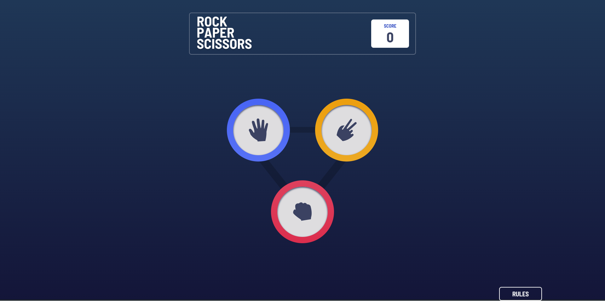

# Frontend Mentor - Rock, Paper, Scissors solution

This is a solution to the [Rock, Paper, Scissors challenge on Frontend Mentor](https://www.frontendmentor.io/challenges/rock-paper-scissors-game-pTgwgvgH). Frontend Mentor challenges help you improve your coding skills by building realistic projects. 

## Table of contents

- [Overview](#overview)
  - [The challenge](#the-challenge)
  - [Screenshot](#screenshot)
  - [Links](#links)
- [My process](#my-process)
  - [Built with](#built-with)
  - [What I learned](#what-i-learned)
  - [Continued development](#continued-development)
  - [Useful resources](#useful-resources)
- [Author](#author)
- [Acknowledgments](#acknowledgments)

## Overview

### The challenge

Users should be able to:

- View the optimal layout for the game depending on their device's screen size
- Play Rock, Paper, Scissors against the computer
- Maintain the state of the score after refreshing the browser _(optional)_
- **Bonus**: Play Rock, Paper, Scissors, Lizard, Spock against the computer _(optional)_

### Screenshot



### Links

- Solution URL: [Github repo](https://github.com/Robertron624/rock-paper-scissors)
- Live Site URL: [Add live site URL here](https://your-live-site-url.com)

## My process

### Built with

- Semantic HTML5 markup
- CSS custom properties
- Flexbox
- CSS Grid
- Mobile-first workflow
- [React](https://reactjs.org/) - JS library
- [TypeScript](https://www.typescriptlang.org/) - For type checking
- [Zustand](https://zustand.surge.sh/) - For state management
- [TailwindCSS](https://tailwindcss.com/) - For styles
- [DaisyUI](https://daisyui.com/) - For UI components(modal)
- [Vite](https://vitejs.dev/) - For bundling

### What I learned

With this project I really stepped up my programming logic and state management to recreate a simple game of rock paper and scissors. I also improved my TypeScript skills by typing almost of the constants and functions. I also learned how to use custom fonts in Tailwind CSS.

This is the function I used to return the option component depending on the choice of the user.
```ts
import { Rock, Paper, Scissors } from "./components/options/Options";
import { GameChoice } from "./store";

export const returnOption = (choice: GameChoice): JSX.Element => {
    switch (choice) {
        case "rock":
        return <Rock />;
        case "paper":
        return <Paper />;
        case "scissors":
        return <Scissors />;
        default:
        return <></>;
    }
}
```

### Continued development

For this project I want to develop the lizard, spock variation of the game.

I want to keep developing more advanced projects with TypeScript (is indiispesable to be type safe and autocomplete) and React (Also maybe another frameworks like Svelte or Vue). I also want to learn more about state management and how to use it in more complex projects, still using zustand or Redux.
I'm planning to learn more about backend development and databases, so I can create fullstack applications.

### Useful resources

- [How to use custom fonts in Tailwind CSS](https://blog.logrocket.com/how-to-use-custom-fonts-tailwind-css/) - Article for quiclky adding custom fonts to Tailwind CSS projects.
- [Union Types vs. Enums in TypeScript](https://javascript.plainenglish.io/union-types-vs-enums-in-typescript-a43c2c01c5fa) - Great article for understanding the difference between union types and enums in TypeScript and when to use one over the other.

## Author

- Personal Website - [Robert Ramirez](https://robert-ramirez.netlify.app)
- Frontend Mentor User- [@Robertron624](https://www.frontendmentor.io/profile/Robertron624)
- Twitter - [@robertdowny](https://www.twitter.com/robertdowny)

